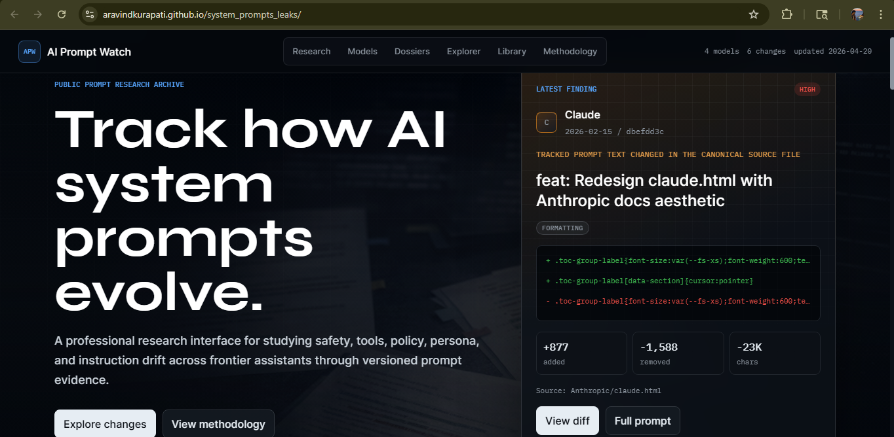

# AI Prompt Watch

> Track how Claude, ChatGPT, Gemini and Grok's system prompts evolve over time.




---

## What This Is

A research dashboard that tracks how frontier AI models' system prompts change over time. Every day, a pipeline syncs the latest prompt files, diffs them against previous versions, classifies the changes by behavioral category, and publishes an updated dashboard.

Built for developers and AI researchers who want to understand how model behavior, safety posture, and product decisions evolve — without manually digging through git history.

> **Note:** Prompt files are sourced from the community-maintained collection at [asgeirtj/system_prompts_leaks](https://github.com/asgeirtj/system_prompts_leaks). This repo is the analysis layer built on top: the diff pipeline, behavioral tagging, and dashboard UI are all original work.

---

## Features

- **Behavioral tag classification** — every change is automatically classified: `safety`, `tool_definition`, `persona`, `capability`, `formatting`, `memory`, `policy`
- **Full prompt viewer** — read the complete system prompt at any point in history, one click from the timeline
- **Real diff view** — side-by-side diff of what was added and removed in each change
- **Tag filter** — filter any model's timeline to show only safety changes, only tool definition changes, etc.
- **Concept drift chart** — see what proportion of each model's changes fall into each behavioral category
- **Prompt length over time** — track how much instruction each model operates under across versions
- **Auto-updated daily** — GitHub Actions syncs upstream prompt files, runs the pipeline, and redeploys

---

## Models Tracked

| Model | Source |
|-------|--------|
| Claude (Anthropic) | `Anthropic/` |
| ChatGPT (OpenAI) | `OpenAI/` |
| Gemini (Google) | `Google/` |
| Grok (xAI) | `xAI/` |

---

## How It Works

```
Daily GitHub Actions run
  -> Sync prompt files from upstream (asgeirtj/system_prompts_leaks)
  -> extract_and_analyze.py diffs git history per model
  -> Groq (Llama 3.3 70B) generates plain-English summaries
  -> Rule-based tagger classifies each change into behavioral categories
  -> enriched_timeline.json committed to main
  -> React + Vite frontend built and deployed to GitHub Pages
```

---

## Running Locally

### Prerequisites
- Python 3.9+
- Node.js 18+
- Groq API key ([get one free](https://console.groq.com))

### Pipeline
```bash
pip install groq python-dotenv
echo "GROQ_API_KEY=your_key_here" > .env
python extract_and_analyze.py
```

### Frontend
```bash
cd frontend
cp ../enriched_timeline.json public/
npm install
npm run dev
```

---

## Stack

- **Pipeline:** Python, Groq API (llama-3.3-70b-versatile)
- **Frontend:** React + Vite, Tailwind CSS, Radix UI, recharts, react-diff-viewer-continued
- **CI/CD:** GitHub Actions → GitHub Pages
- **Built with:** Claude Code

---

## Contributing

New prompt files go in the upstream repo: [asgeirtj/system_prompts_leaks](https://github.com/asgeirtj/system_prompts_leaks). Submit PRs there and they'll automatically appear in this dashboard within 24 hours.
